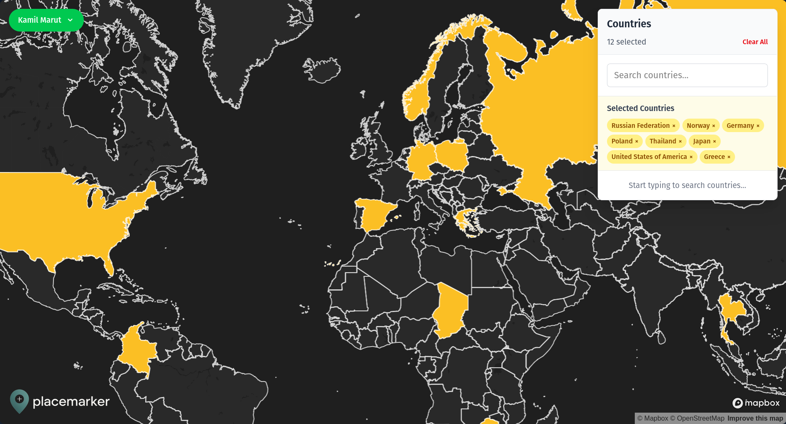

# Placemarker

    
    
📍 World map to track the countries you've been to 

## Overview

Placemarker is a React SPA app that allows you to track the countries you've visited on a world map.

The app uses IndexedDB to store the data on the client's device. You can also authenticate and sync your data cross-device using Pocketbase.

## Screenshot

## Features

- Mark countries you visited on a world map
- Mark your home country
- Share your map with others
- Sync your data across devices
- Authenticate using OAuth2 (Google, GitHub) or email/password

## Advertisement

Are you looking for a proficient full-stack engineer to help you with your next project and you happen to enjoy my work? I am available for hire! Reach out to me via [my website](https://kamilmarut.com).

## License

`Placemarker` is under the terms of the [MIT License](https://www.tldrlegal.com/l/mit), following all clarifications stated in the [license file](LICENSE).
